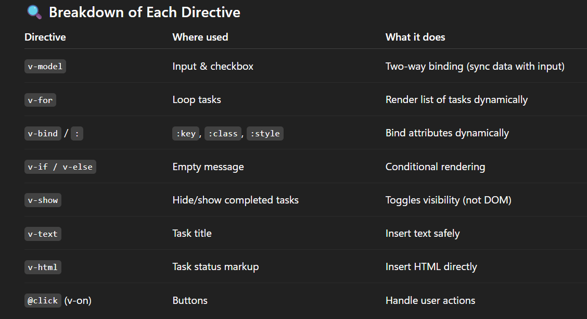
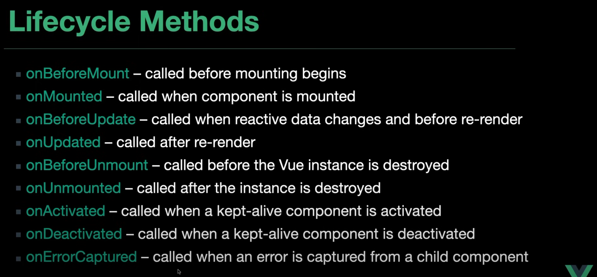

## Vue.js Learning Resources

**This** document tracks the Vue.js concepts and features I have learned and implemented in this workspace.

| #   | Concept                 | Description                                                        | Use Case                                   | Example                                      |
| --- | ----------------------- | ------------------------------------------------------------------ | ------------------------------------------ | -------------------------------------------- |
| 1   | **ref()**               | Reactive variable that holds value and enables reactivity in Vue 3 | Creating reactive primitive values         | `const count = ref(0)`                       |
| 2   | **reactivity**          | System that makes data reactive between script and template        | Automatic UI updates when data changes     | Data binding, computed properties            |
| 3   | **v-bind**              | Dynamically bind data to HTML attributes                           | Dynamic attribute binding                  | `:class="active"`, `:style="styles"`         |
| 4   | **v-if**                | Conditional rendering based on boolean expression                  | Show/hide elements conditionally           | `v-if="isVisible"`, `v-else-if`, `v-else`    |
| 5   | **v-for**               | Render lists by iterating over arrays/objects                      | Display dynamic lists                      | `v-for="item in items" :key="item.id"`       |
| 6   | **watch()**             | Watch reactive data changes and execute functions                  | Side effects on data changes               | API calls, validation, logging               |
| 7   | **v-on (@)**            | Listen to DOM events and execute methods                           | Event handling                             | `@click="handleClick"`, `@submit="onSubmit"` |
| 8   | **Class/Style Binding** | Dynamic binding of classes and styles                              | Conditional styling                        | `:class="{ active: isActive }"`              |
| 9   | **computed()**          | Create derived state from reactive data (cached)                   | Calculated values                          | Filtered lists, formatted data               |
| 10  | **toRefs()**            | Convert reactive object to plain object with refs                  | Destructuring while maintaining reactivity | `const { name, age } = toRefs(user)`         |
| 11  | **emit()**              | Send custom events from child to parent                            | Component communication                    | `emit('update', value)`                      |
| 12  | **defineProps()**       | Define props a component accepts from parent                       | Component input validation                 | `defineProps(['id', 'name'])`                |
| 13  | **reactive()**          | Create reactive object with deep reactivity                        | Complex object state                       | `const state = reactive({ user: {} })`       |
| 14  | **v-model**             | Two-way data binding for form inputs                               | Form handling                              | `v-model="inputValue"`                       |
| 15  | **onMounted()**         | Lifecycle hook called after DOM mounting                           | Initialization tasks                       | API calls, DOM manipulation                  |
| 16  | **useRoute()**          | Access current route object information                            | Route data access                          | `route.params.id`, `route.query.search`      |
| 17  | **useRouter()**         | Access router instance for navigation                              | Programmatic navigation                    | `router.push()`, `router.replace()`          |

### Directive Categories

| Category           | Directives                              | Purpose                    |
| ------------------ | --------------------------------------- | -------------------------- |
| **Data Binding**   | `v-bind`, `v-model`                     | Connect data to template   |
| **Conditional**    | `v-if`, `v-else-if`, `v-else`, `v-show` | Control element visibility |
| **List Rendering** | `v-for`                                 | Render arrays/objects      |
| **Event Handling** | `v-on (@)`                              | Handle user interactions   |
| **Text Content**   | `v-text`, `v-html`                      | Display text/HTML content  |

### Composition API Functions

| Function        | Type       | Purpose                   | Returns                   |
| --------------- | ---------- | ------------------------- | ------------------------- |
| `ref()`         | Reactivity | Create reactive reference | `Ref<T>`                  |
| `reactive()`    | Reactivity | Create reactive object    | `Reactive<T>`             |
| `computed()`    | Reactivity | Create computed property  | `ComputedRef<T>`          |
| `watch()`       | Reactivity | Watch data changes        | `WatchStopHandle`         |
| `onMounted()`   | Lifecycle  | Mount lifecycle hook      | `void`                    |
| `defineProps()` | Component  | Define component props    | `Props`                   |
| `defineEmits()` | Component  | Define component events   | `Emit`                    |
| `useRoute()`    | Router     | Access current route      | `RouteLocationNormalized` |
| `useRouter()`   | Router     | Access router instance    | `Router`                  |

### 1. **Vue.js Fundamentals**

- ✅ Vue 3 project setup with Vite
- ✅ Single File Components (SFC) structure
- ✅ Template syntax and directives
- ✅ Component composition and organization

### 2. **Template Interpolation & Data Binding**

- ✅ **Text Interpolation** - [`TextInterpolation.vue`](Vue-Course/src/components/TextInterpolation.vue)
  - Mustache syntax `{{ }}`
  - Displaying dynamic data in templates
  - Basic event handling with `@click`

### 3. **Attribute Binding**

- ✅ **V-Bind Directive** - [`VBind.vue`](Vue-Course/src/components/VBind.vue)
  - Binding data to HTML attributes (`:src`, `:alt`, `:class`)
  - Conditional classes based on data
  - Dynamic attribute binding
- ✅ **Advanced Attribute Binding** - [`AttributeBinding.vue`](Vue-Course/src/components/AttributeBinding.vue)
  - Multiple binding syntaxes (`v-bind:` vs `:`)
  - Dynamic object binding
  - Boolean attribute binding

### 4. **Event Handling**

- ✅ **Basic Event Handling** - [`EventHandler.vue`](Vue-Course/src/components/EventHandler.vue)
  - Click events with `@click`
  - Method definitions and execution
  - State manipulation through events
- ✅ **Form Event Handling** - [`FormEventHandler.vue`](Vue-Course/src/components/FormEventHandler.vue)
  - Form submission with `@submit.prevent`
  - Two-way data binding with `v-model`
  - Form validation and user input handling

### 5. **Reactivity System**

- ✅ **Ref API** - [`RefComponent.vue`](Vue-Course/src/components/RefComponent.vue)
  - Creating reactive references with `ref()`
  - Working with primitive and complex data types
  - Updating reactive data (.value syntax)
  - Arrays and objects in refs
- ✅ **Reactive API** - [`ReactiveComponent.vue`](Vue-Course/src/components/ReactiveComponent.vue)
  - Creating reactive objects with `reactive()`
  - Nested object reactivity
  - Direct property manipulation

### 6. **List Rendering**

- ✅ **V-For Directive** - [`VFor.vue`](Vue-Course/src/components/VFor.vue)
  - Iterating over arrays
  - Using `:key` for list optimization
  - Accessing array items and properties
  - Template rendering for each item

### 7. **Conditional Rendering**

- ✅ **V-If/V-Else/V-Else-If** - [`VIf.vue`](Vue-Course/src/components/VIf.vue)
  - Conditional DOM rendering
  - Complex conditional logic
  - Loading states and user authentication flows
- ✅ **V-Show Directive** - [`VIf.vue`](Vue-Course/src/components/VIf.vue)
  - CSS-based visibility toggling
  - Performance considerations (v-if vs v-show)
  - Dynamic UI controls

### 8. **Computed Properties**

- ✅ **Computed Values** - [`VComputed.vue`](Vue-Course/src/components/VComputed.vue)
  - Reactive computed properties with `computed()`
  - Automatic dependency tracking
  - Performance optimization through caching
  - Derived state management

### 9. **Component Lifecycle**

- ✅ **OnMounted Hook** - [`OnMounted.vue`](Vue-Course/src/components/OnMounted.vue)
  - Component lifecycle management
  - API calls on component mount
  - Async data fetching
  - Loading states and error handling

### 10. **Component Architecture & Communication**

- ✅ **Props** - [`Balance.vue`](Expense-Tracker/src/components/Balance.vue), [`IncomeExpense.vue`](Expense-Tracker/src/components/IncomeExpense.vue)
  - Parent-to-child data passing
  - Prop validation and type checking
  - Required props and default values
- ✅ **Events (Emit)** - [`AddTransaction.vue`](Expense-Tracker/src/components/AddTransaction.vue), [`TransactionList.vue`](Expense-Tracker/src/components/TransactionList.vue)
  - Child-to-parent communication
  - Custom event emission with `defineEmits`
  - Event payload handling

### 11. V Directives Overview

### 12. Lifecycle Methods Overview

## 🎯 Practical Projects

### 1. **Vue Course Examples** - [`Vue-Course/`](Vue-Course/)

A comprehensive collection of Vue.js feature demonstrations covering all fundamental concepts.

### 2. **Expense Tracker Application** - [`Expense-Tracker/`](Expense-Tracker/)

A complete CRUD application featuring:

- Add/delete transactions
- Income and expense calculation
- Local storage persistence
- Toast notifications
- Component communication patterns

---

_This learning journey demonstrates proficiency in Vue.js fundamentals and practical application development._

### Contents

- [Vue.js Official Documentation](https://vuejs.org/guide/quick-start.html)
- [Vue.js Explained in 100 Seconds](https://youtu.be/nhBVL41-_Cw?si=4eIkd45jzlxgeN4Z)
- [Vue.JS Setup with Tailwind CSS](https://youtu.be/P5d_UUxqOzs?si=KeMc70jda6jCQzhj), [Tailwind CSS Vue Doc](https://tailwindcss.com/docs/installation/using-vite)
- [HuXn WebDev : Master Vue.js Composition API: Build 10 Stunning Projects for Real-world Expertise!](https://www.youtube.com/watch?v=pgWZLS75Nmo), [GitHub Repo](https://github.com/HuXn-WebDev/Vue.js-Complete-Course-With-10-Projects)
- [Simple Expense Tracker App using Vue 3 and Composition API](https://www.youtube.com/watch?v=hNPwdOZ3qFU)

### Resources

- [Dummy Product Json API for basic implementation](https://dummyjson.com/docs/products)
